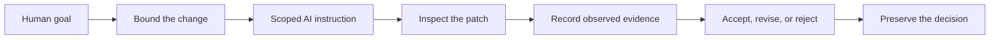

# Developer Atlas

## Keep control of AI-generated code changes

**Define what may change, inspect what actually changed, record real evidence, and make the final human decision.**

### Start with one controlled change

1. **[Open Control Lite](control-lite/index.html)** and define a bounded change.
2. Generate a scoped AI instruction and review record.
3. Compare the supplied or real patch with the allowed scope.
4. Record checks as **Passed**, **Failed**, or **Not run**.
5. Decide to **Accept**, **Revise**, or **Reject**.
6. Open the related public Compendium node when a concept or boundary needs explanation.

[Try the guided Control walkthrough →](docs/getting-started/TRY_ATLAS.md)

> **Current status:** public preview and internal alpha. The technical lifecycle is real and tested,
> while broad usability, repeat use, independent review, and willingness to pay remain unproven.

## The Atlas control loop

Atlas does not ask an AI to certify its own work. Missing evidence remains **Not run**, scope expansion
remains visible, and the accountable human keeps the final decision.

## Three connected product surfaces

| Surface | Job | Public experience |
| --- | --- | --- |
| **Control** | Define scope, evidence requirements, and the final decision | [Control Lite](control-lite/README.md) and the [15-minute walkthrough](docs/getting-started/TRY_ATLAS.md) |
| **Navigator** | Show a bounded Laravel route → controller → Blade flow in VS Code | [Build the limited public VSIX](navigator-preview/README.md) |
| **Compendium** | Explain unfamiliar concepts with version scope, evidence, and practical boundaries | [Open the six-node public preview](compendium-preview/index.html) |

The learning missions and packs support onboarding, but they are not the primary product.

## What the public preview demonstrates

### Keep the AI in scope

Declare allowed files, protected behavior, acceptance criteria, required checks, and parked ideas before
a patch begins. Suggestions outside that boundary remain visible without silently entering the change.

### Understand what changed

Navigator connects Laravel routes, controllers, Blade views, components, and dependencies so a reviewer
can reason about a patch instead of accepting a diff on trust.

### Separate claims from evidence

A test command written in an AI response is not evidence that the command ran. Atlas records each
required check as Passed, Failed, or Not run and keeps known limitations beside the decision.

### Learn without leaving the review

Contextual learning cards connect unfamiliar code to Compendium nodes whose source mapping,
AI-assistance state, version scope, limitations, and independent-review state remain visible.

## One honest worked example

The current Laravel exercise asks for a clearer review-ready status page. The proposed patch stays
inside its two-file boundary, but the repository cannot execute the required Laravel test. The sample
decision is therefore **Revise**, not an invented pass.

[Review the complete Laravel example](control/examples/laravel-status-label/README.md), then try the [runnable remaining-count exercise](control/exercises/browser-list-count/README.md).

## Availability

| Experience | Available | Current boundary |
| --- | --- | --- |
| Browser-based Control Lite | Yes | Local templates and review workflow; no AI or command execution |
| Guided Laravel Control exercise | Yes | Static example; the real Laravel test remains Not run |
| Safe browser teaching example | Yes | Learning fixture, not the full product |
| Selected missions and nodes | Yes | Curated preview; independent review is incomplete |
| Limited Navigator VSIX | Buildable public preview | Conventional Laravel controller-array routes only; unsigned and not the private product |
| Compendium preview | Yes, local and deployable | Six allowlisted public nodes; no private Compendium source or full Lexicon |

## Evidence, privacy, and limitations

The private development repository currently validates 54 maintained Knowledge Nodes, 664 Lexicon
entries, 752 generated Compendium pages, and the Control, Continuity, Navigator, Compendium, policy,
security, packaging, and lifecycle checks. Founder dogfooding, a five-person embedded design cohort,
and one external-alpha round support formative usefulness—not product-market fit.

The public preview is local-first, contains no telemetry, requires no account, performs no silent AI
action, and does not execute or infer verification results. Public exports pass through an allowlist,
secret and path scanning, local-link validation, integrity hashes, and human review.

Read the [testing status](docs/public/testing-status.md), [known limitations](docs/public/known-limitations.md),
[privacy and safety notes](docs/public/privacy-and-safety.md), and [security policy](.github/SECURITY.md).

## Explore and contribute

- [Public documentation](docs/README.md)
- [Product roadmap](docs/product/ROADMAP.md)
- [Mission index](content/missions/README.md)
- [AI Collaboration Pack](packs/ai-collaboration/README.md)
- [Feedback instructions](docs/testing/FEEDBACK.md)
- [Contribution guide](.github/CONTRIBUTING.md)

## License and provenance

The files in this public preview are available under the [MIT License](LICENSE). The private Developer
Atlas monorepo and unreleased product source are separate and are not licensed by this repository.
Development is materially AI-assisted and human-directed; automated checks remain separate from
independent human review and final acceptance. See [PROVENANCE.md](docs/governance/PROVENANCE.md) and
the outcome-focused [CHANGELOG.md](CHANGELOG.md).
