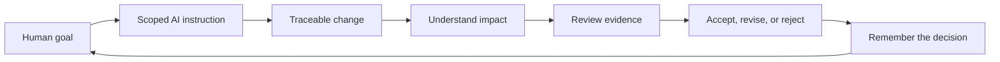

# Developer Atlas

**Understand the landscape. Choose the path. Steer the work.**

Developer Atlas is an early, local-first human-control system for AI-assisted
software development. It helps developers define boundaries, understand what an
AI changed, review evidence, and make the final decision themselves.

> **Current status:** public preview and internal alpha. The software is real
> and extensively tested, but broad usability, retention, and paid demand have
> not been established.

## Why Atlas exists

AI can produce code faster than a person can understand, review, and remember
it. A change may work while still leaving its owner unable to explain the scope,
spot an assumption, or guide the next change consistently.

Atlas is being built around one control loop:

Atlas is not an autonomous coding agent, a replacement for an IDE, or a claim
that AI-generated code is correct. The human owns the goal and final acceptance.

## Product family

| Surface | What it does | Current status |
| --- | --- | --- |
| **Atlas Navigator** | Shows code flow, impact, and contextual learning inside VS Code | Public preview candidate |
| **Atlas Compendium** | Connects the Lexicon, Field Guides, and reviewed programming knowledge | Internal alpha; public hosting in preparation |
| **Atlas Control** | Turns preferences and scope into change contracts, evidence, and decisions | Working local CLI; editor workflow planned |
| **Atlas Continuity** | Supervises local project readiness, health, recovery, and known-good state | Standalone alpha; real-project validation pending |
| **First Expedition** | Provides small guided projects that build confidence and control | Selected public materials available here |

The current product focus is the connection between Control and Navigator. The
other surfaces support that workflow rather than competing to be separate
products.

## What is working

### See how code connects

Navigator traces a Laravel request from route to controller, Blade view, and
included partial without executing arbitrary project commands.

### Review impact before accepting a change

Impact and Git comparison views show incoming users, outgoing dependencies, and
flow changes while project content remains local.

### Understand unfamiliar code in context

Compact learning cards explain concepts beside the code and link to deeper
Compendium evidence only when it is needed.

### Explore the Compendium

The Compendium connects an extensive programming Lexicon with reviewed nodes,
practical mistakes, trade-offs, verification guidance, and focused routes.

More screenshots and their review status are listed in
[`screenshots/README.md`](screenshots/README.md).

## Try the public preview

This repository currently contains intentionally limited, public-safe material:

- [`START_TESTING.md`](https://github.com/DeveloperAtlas5/DeveloperAtlas-Public/blob/main/START_TESTING.md) — choose one short evaluation path;
- [`packs/ai-collaboration/`](https://github.com/DeveloperAtlas5/DeveloperAtlas-Public/tree/main/packs/ai-collaboration) — prompts and review habits;
- [`content/missions/`](https://github.com/DeveloperAtlas5/DeveloperAtlas-Public/tree/main/content/missions) — selected guided missions;
- [`content/nodes/`](https://github.com/DeveloperAtlas5/DeveloperAtlas-Public/tree/main/content/nodes) — selected knowledge-node examples;
- [`examples/`](examples/) — small runnable browser projects.

The complete Canon, private product source, internal strategy, raw feedback, and
private project material are deliberately not published here.

## Evidence, honestly stated

The private development repository currently validates:

- 54 maintained knowledge nodes and 664 Lexicon entries;
- 752 generated Compendium pages;
- automated Control, Continuity, Navigator, Compendium, policy, security, and
  lifecycle checks;
- founder dogfooding and a five-person embedded design cohort;
- one preserved external-alpha round whose same-tester retest remains pending.

This supports technical credibility and formative usefulness. It does **not**
yet prove product-market fit, retention, willingness to pay, or universal
correctness. See [`docs/public/testing-status.md`](docs/public/testing-status.md)
and [`docs/public/known-limitations.md`](docs/public/known-limitations.md).

## What we are working on now

1. Completing an editor-native Control Lite workflow in Navigator.
2. Reducing first-run ceremony and information density.
3. Repeating the external-alpha workflow after the latest fixes.
4. Validating Continuity on a real Windows Laravel/Vue/SQLite project.
5. Completing independent human review for the most important knowledge nodes.
6. Preparing a safe hosted Compendium and measurable public preview.

The public roadmap lives in [`ROADMAP.md`](ROADMAP.md).

## Privacy and trust

- Local-first by default.
- No telemetry in the current Navigator preview.
- No account or payment requirement in the current free preview.
- No silent AI actions, terminal execution, or acceptance decisions.
- Remote Compendium links require HTTPS; localhost is allowed for development.
- Public material passes through a one-way allowlist and manual review.

Read [`SECURITY.md`](SECURITY.md) and
[`docs/public/privacy-and-safety.md`](docs/public/privacy-and-safety.md) for the
current boundaries.

## Follow or contribute

Developer Atlas is not yet accepting unrestricted implementation contributions,
but precise feedback is welcome. Open an issue for:

- a reproducible bug;
- an unclear first step or explanation;
- an accessibility barrier;
- a privacy or trust concern without exploit details;
- a workflow that would help you stay in control of AI-assisted development.

Researchers, educators, tool builders, and teams exploring human-controlled AI
development are welcome to start a GitHub Discussion. Atlas is being built as a
product, not presented as an acquisition listing.

See [`CONTRIBUTING.md`](CONTRIBUTING.md) and the public
[`FEEDBACK.md`](https://github.com/DeveloperAtlas5/DeveloperAtlas-Public/blob/main/FEEDBACK.md).

## License and provenance

The files committed to this public preview are available under the
[MIT License](LICENSE). The private Developer Atlas monorepo and unreleased
product source are separate and are not licensed by this repository.

Development is materially AI-assisted and human-directed. Automated verification
is kept separate from independent human review and final acceptance. See
[`PROVENANCE.md`](PROVENANCE.md).
