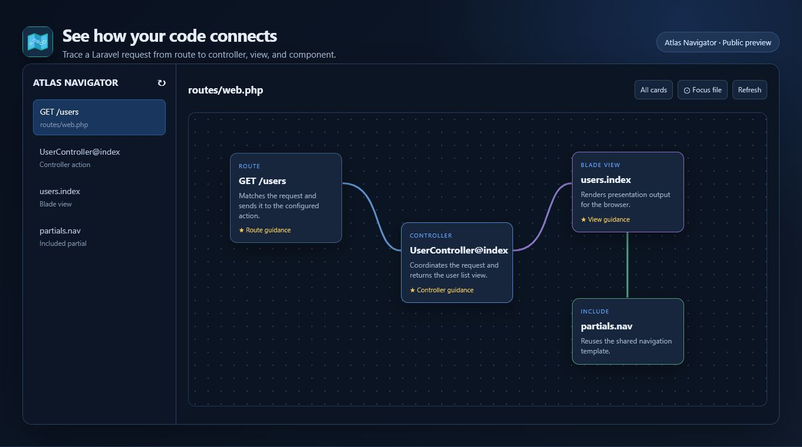
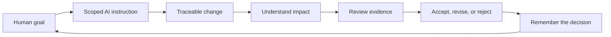
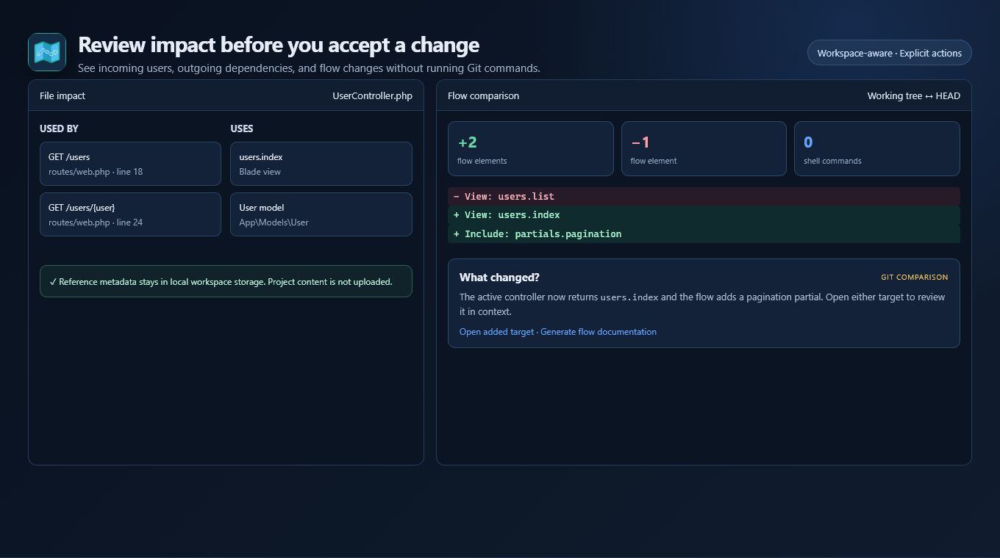
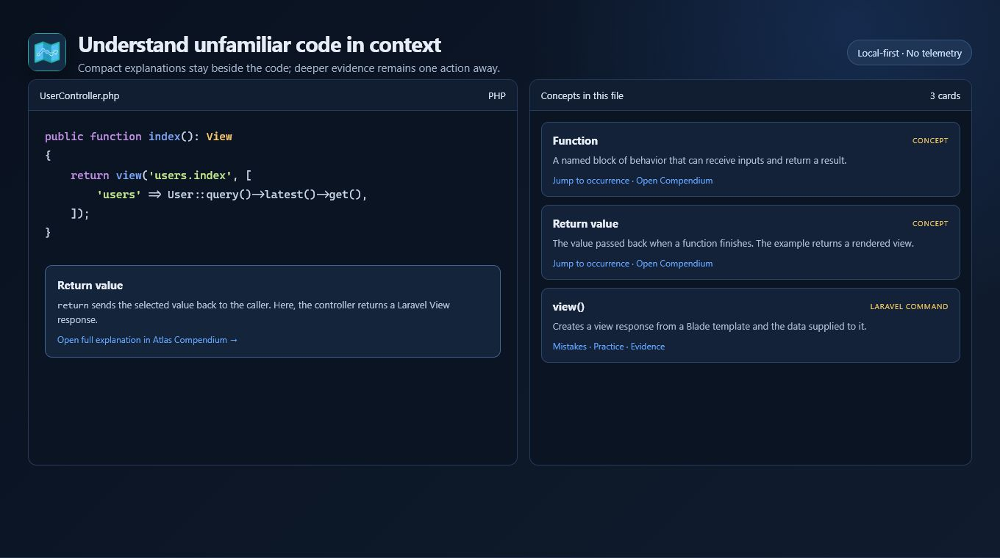
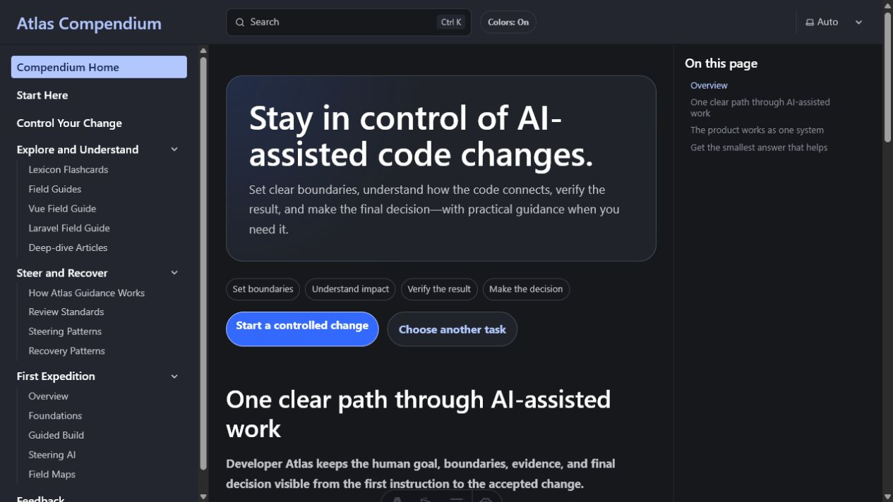

# Developer Atlas

**Human-controlled AI development for Laravel and Vue: define scope, understand changes, review
evidence, and make the final decision.**

### [Build a local Change Contract with Control Lite →](control-lite/README.md)

**[Try the guided 15-minute Control walkthrough](docs/getting-started/TRY_ATLAS.md)** 
**[See current Navigator preview access](https://github.com/DeveloperAtlas5/DeveloperAtlas-Public/blob/main/docs/testing/START_TESTING.md)**
**[Browse all public documentation](docs/README.md)**

> **Current status:** public preview and internal alpha. The software and control lifecycle are real
> and extensively tested. Broad usability, retention, independent review, and paid demand remain
> unproven.

## Keep AI-assisted work understandable and bounded

AI can produce code faster than a person can understand, review, and remember it. Atlas is being
built around one explicit loop:

### Keep the AI in scope

Declare allowed files, protected behavior, acceptance criteria, and parked ideas before a patch
begins. Risky expansion remains a human confirmation boundary.

### Understand what changed

Navigator connects routes, controllers, views, dependencies, and learning context so the reviewer can
reason about the change instead of accepting a diff on trust.

### Verify before accepting

Atlas separates scope conformance from observed checks. A missing test result remains “not run”; the
AI cannot promote its own claim into evidence or make the final decision.

## One concrete example

The public exercise starts with this request:

> Improve the status page so a reviewer knows the application is ready for a human check.

The baseline prompt contains no file boundary or proof requirement. The Atlas-controlled version
allows two Laravel files, protects routes and authentication, defines visible acceptance criteria,
and requires honest test reporting.

The supplied patch stays in scope, but the completed decision is **revise** because this static
repository cannot run the real Laravel test command. That is the product thesis in practice: preserve
useful work without pretending missing evidence is a pass.

[Open the complete worked example](control/examples/laravel-status-label/README.md).

## Control, Navigator, and Compendium

Near the top, Atlas has three jobs:

- **Control** defines the change, records supplied evidence, and preserves the human decision.
- **Navigator** brings the lifecycle into VS Code beside code flow and impact.
- **Compendium** supplies primary-source-mapped context when the reviewer needs to understand a
  concept or boundary.

Control Lite now provides Prepare → Instruct → Evidence → Decide inside Navigator. It writes only to
the local project, does not launch an AI, does not run the declared verification command, and does not
infer acceptance.

### See code flow

Navigator traces a Laravel request from route to controller, Blade view, and included partial without
executing arbitrary project commands.

### Review impact

Impact and Git comparison views expose incoming users, outgoing dependencies, and flow changes while
project content remains local.

### Learn in context

Compact cards explain unfamiliar code and link to Compendium nodes whose AI-assisted and independent
review states remain visible.

### Explore the Compendium preview

The Compendium connects a large programming Lexicon with practical mistakes, version scope,
verification design, and evidence. Public hosting is still being prepared; screenshots and selected
node samples are available here now.

More images and their review status are listed in [`screenshots/README.md`](screenshots/README.md).

## Current availability

| Experience | Available here | Limitation |
| --- | --- | --- |
| Local Control Lite generator | Yes | Runs in the browser; does not execute AI or verification commands |
| Guided Control walkthrough | Yes | Static Laravel example; no real Laravel runtime |
| Safe browser example | Yes | Learning example, not the full product |
| Selected missions and nodes | Yes | Curated preview; independent review pending |
| Navigator VSIX | Tester access only | General signed release and clean-profile proof pending |
| Hosted Compendium | Not yet | Static hosting review in progress |

The manual packaging workflow can prepare a checksum-listed exercise archive for maintainer review.
See [`DOWNLOAD.md`](docs/getting-started/DOWNLOAD.md); no public release is implied until a human publishes one.

## Evidence and limitations

The private development repository currently validates:

- 54 maintained Knowledge Nodes and 664 Lexicon entries;
- 752 generated Compendium pages;
- Control, Continuity, Navigator, Compendium, policy, security, packaging, and lifecycle checks;
- founder dogfooding and a five-person embedded design cohort;
- one preserved external-alpha round whose same-tester retest remains pending.

Every exported node now shows its evidence date, source count, AI assistance, automated check state,
version scope, and pending independent human review. “Gold” describes an internal teaching-depth
target; it does **not** mean final certification.

This supports technical credibility and formative usefulness. It does not prove product-market fit,
retention, willingness to pay, universal correctness, or production safety. Read
[`testing-status.md`](docs/public/testing-status.md),
[`known-limitations.md`](docs/public/known-limitations.md), and the public [`FAQ`](docs/product/FAQ.md).

## Supporting work

The learning material helps people build the understanding needed to use the control loop; it is not
the primary product demonstration.

| Area | Role | Start |
| --- | --- | --- |
| First Expedition and beginner missions | Confidence-building onboarding | [Mission index](content/missions/README.md) |
| AI Collaboration Pack | Prompt and review habits | [Pack entry](packs/ai-collaboration/README.md) |
| Public node samples | Just-in-time concept reference | [Node index](content/nodes/README.md) |
| Continuity research | Local readiness, health, and recovery | Tracked as parallel alpha work in the roadmap |
| Testing and research | Protocols, facilitator questions, evidence status | [Testing status](docs/public/testing-status.md) |

## Privacy and trust

- Local-first by default.
- No telemetry in the current Navigator preview.
- No account or payment requirement in the current free preview.
- No silent AI actions, verification execution, or acceptance decisions.
- Remote Compendium links require HTTPS; localhost is allowed for development.
- Public material passes through a one-way allowlist, secret/path scanning, local-link validation, and
  manual review.
- Runnable browser teaching code is tested against HTML-like user input and may not assign user data
  through `innerHTML`.

Read [`SECURITY.md`](.github/SECURITY.md) and
[`privacy-and-safety.md`](docs/public/privacy-and-safety.md).

## Roadmap and feedback

The immediate public focus is to validate Control Lite in a clean profile, repeat the external-alpha
workflow, publish a safe preview artifact, and measure whether the control loop helps real reviewers.
The public [`ROADMAP.md`](docs/product/ROADMAP.md) keeps supporting research separate.

Precise feedback is welcome for reproducible bugs, unclear first steps, accessibility barriers,
privacy concerns, or workflows that would help people retain control. See
[`CONTRIBUTING.md`](.github/CONTRIBUTING.md) and the public
[`FEEDBACK.md`](https://github.com/DeveloperAtlas5/DeveloperAtlas-Public/blob/main/docs/testing/FEEDBACK.md).

## License and provenance

The files committed to this public preview are available under the [MIT License](LICENSE). The
private Developer Atlas monorepo and unreleased product source are separate and are not licensed by
this repository.

Development is materially AI-assisted and human-directed. Automated verification is kept separate
from independent human review and final acceptance. See [`PROVENANCE.md`](docs/governance/PROVENANCE.md) and the
outcome-focused [`CHANGELOG.md`](CHANGELOG.md).
