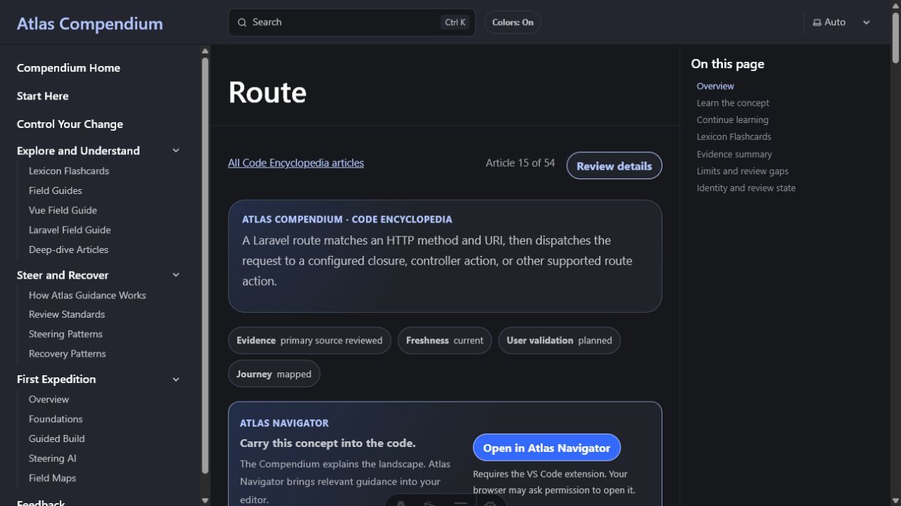

# Public Knowledge Node samples

For developers who need a concise concept explanation while reviewing code.

- **Finish:** understand one concept well enough to continue the current task.
- **Time:** 5–10 minutes per node.
- **Requirements:** none.

## Start

Open the [node index](../../content/nodes/README.md). Useful first samples:

- [JavaScript](../../content/nodes/gold/CANON-JAVASCRIPT-001.md)
- [DOM](../../content/nodes/gold/CANON-DOM-001.md)
- [Laravel route](../../content/nodes/gold/CANON-ROUTE-001.md)
- [Request lifecycle](../../content/nodes/gold/CANON-LARAVEL-REQUEST-LIFECYCLE-001.md)

## What you will see

Every sample starts with its source count, last verification date, AI-assisted review state, and
pending independent human review. “Gold” names an internal teaching-depth target, not certification.

## Next

Return to the code task that brought you here, or use the
[Control exercise](../../TRY_ATLAS.md) to apply a concept inside a bounded change.

## Help

Known limitations are linked from every node. Report unclear or unsupported claims through the
public [feedback route](https://github.com/DeveloperAtlas5/DeveloperAtlas-Public/blob/main/FEEDBACK.md).
