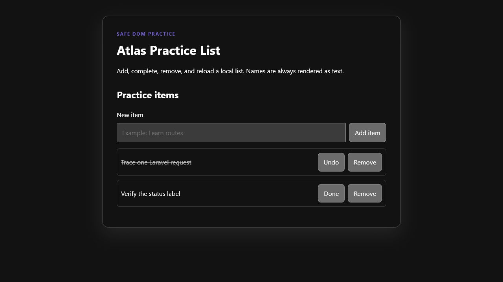

# Rookie browser application path

For learners who know basic HTML, CSS, and JavaScript and want to manage small application state.

- **Finish:** a list that adds, completes, removes, and reloads items.
- **Time:** 60–120 minutes across two missions.
- **Requirements:** a modern browser; Node.js 22 only if you want to run the automated checks.

## Start

1. [Mission 4 — DOM List](../../content/missions/en/MISSION-DOM-LIST-004.md)
2. [Mission 5 — localStorage](../../content/missions/en/MISSION-LOCALSTORAGE-005.md)
3. [Run the completed browser example](../../examples/browser-list-starter/)

## Expected result

The list persists after reload and displays HTML-like names as literal text. The public browser test
proves add, toggle, remove, persistence, and safe text rendering.

## Next

Use the [PHP/Laravel bridge](../php-laravel/README.md). The future Vue track is not yet presented as
complete; translation coverage is visible in the [mission index](../../content/missions/README.md).

## Help

Use the mission recovery card before expanding the feature. Report reproducible issues through the
public [feedback route](https://github.com/DeveloperAtlas5/DeveloperAtlas-Public/blob/main/FEEDBACK.md).
